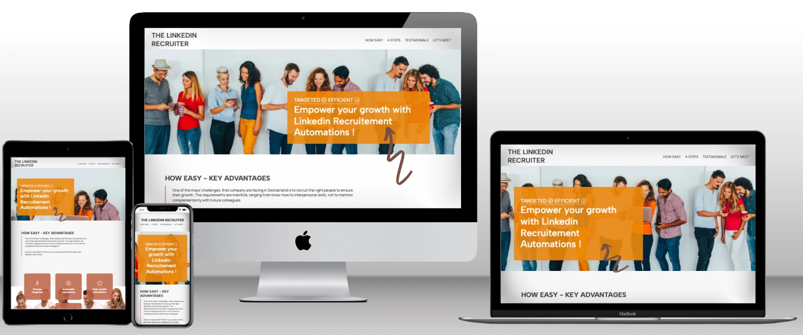

<h1>CHALLENGE 1 | HTLM & CSS</h1>

### Background / Userstory

The LinkedIn Recruiter website is designed to offer company directors, department heads of and HR manager & recruiter a tool enabling them to “hunt” on LinkedIn for profiles matching their requirements.

The service differs from headhunting company in that it is much more cost-competitive, and from job boards, in that it's not generating a lot of irrelevant applications.

The website is targeting : company directors and owners, humain ressource directors,hiring manager and head hunters.

The goal of the website is to generate lead by inviting people to send a form to have a deeper presentation and understanding of the service. The goal is the same if you come for the first time and more then one time.

The website is designed to demonstrate the benefit of our solution and to give it credibily with testimonials.

The website is designed too to explain the main steps of our service to give an understanding of how it work and the potentiel benefit of it.

### Github Live Link

<ul>
    <li><a href="https://philippeitsme.github.io/ci-portfolio1/" target="_blank">Github Live</a></li>
</ul>

### Layout

### Features

<ul>
    <li>Navigation bar -> to navigate inside the page, a smooth scolling js code is in place to make the move pleasant, the four part of the webiste are in the menu</li>
    
    <li>Header ->to have a brief description of the service, to understand the pain point adressed with the service, to tease people to read the bellow sections</li>
    
    <li>How easy -> to understand users benefits, to understand the wins with this solution</li>
    
    <li>4 steps -> to understant the process of the service, the 4 steps that will help recruiter in findent the good employee for their organisaation</li>
    
    <li>Testimonials -> to have social proofs (generated by IA), to have convincing testimonials,to consolidate the image of the company</li>
    
    <li>Let's discuss your need -> to have a easy to use contact form to ease lead generation</li>
    
    <li>Footer -> to have a easy acess to our contact data and to allow visitor to follow us on social media</li>
    
</ul>

### Design elements

#### Main colors
Primary color : orange #d27905 and brun #bb5a3c
Secondary color : antracite #414040 and white #ffffff

Light variation of orange, burn and antracite a sometime used.

#### Main fonts
Title : Albert Sans
Paragraph : Manrope

### Languages useds

<ul>
    <li>HTML5</li>
    <li>CSS</li>
    <li>JAVASCRIPT (as requested in the feedback of the first submission)</li>
</ul>

### Testing

I personnaly tested the website on Chrome, Safair, Firefox and on desktop, ipad and iphone.
Friends were asked to navigate on it for feedbacks.

<ul>
    <li>W3 HTML Validator : ✅</li>
    <li>W3 CSS Validator ✅ : </li>
    <li>Chrome : ✅</li>
    <li>Safari : ✅</li>
    <li>Firefox : ✅</li>
    <li>Responsivness : ✅</li>
    <li>Target="_blank" in place : ✅</li>
    <li>Form plugged to a dB : ✅</li>
    
</ul>

W3 Validator output : 

 
 

Userstory testing : 
<ul>
    <li>Point of pain solving proposition (in the fist section) : ✅</li>
    <li>Benefit presentation : ✅</li>
     <li>Step of the recruitement process : ✅</li>
     <li>Testimonials : ✅</li>
     <li>Easy contact opportunity (form & footer) : ✅</li>
</ul>

404 pages : working well ✅

### Speed - Lighthouse

Looking great ✅

### Debugging

#### HTML&CSS
Just one synthax issue on the grid technology and the form background color that needed to be darker.

NEW : adding Favicon

NEW : adding dB behind the form (link to the Code Institut dB)

NEW : taking out the H4 to have a more coherent title system

NEW : adding 404 page

#### JAVASCRIPT
NEW : adding smooth scrolling JS code

#### PERFORMANCE :
Had to convert all picture to webp and set a preload line on the html head code.

### Deployment

#### Version Control

The site was created using Visual Studio Code and Gitpod editor and pushed to Github to the remote repository "ci-portfolio1".

Git commands were used throughout the development to push the code to the remote repository. 

The following git commands were used:
<ul>
    <li>git add . - to add the files to the staging area before being committed.</li>
    <li>git commit -m "commit message" - to commit changes to the staging step.</li>
    <li>git push - to push all committed code to the remote repository on Github.</li>
</ul>

#### Deployment to Github pages

The site was deployed to Github as follow:
<ol>
    <li>In the Github repository, navigat to Settings tab</li>
    <li>From the source section drop-down menu, select the Master branch and Save</li>
    <li> Once the Master branch is selected, the page provided the link to the website</li>
</ol>

#### Cloning of the Repository Code locally

<ol>
    <li>Go to the Github repository that you want to clone</li>
    <li>Click on the Code button located above all the project files</li>
    <li>Click on HTTPS and copy the repository link</li>
    <li>Open the IDE of your choice and and paste the copied git url into the IDE terminal</li>
    <li>The project is now created as a local clone</li>
</ol>

### Credits

<ul>
    <li>All images are from Canvas.</li>
    <li>All pictos are from Font Awesome.</li>
    <li>The 4 steps sections design is inspired by the Running Challenge, Code Institue.</li>
    <li>Testimonial are generated by Open AI and therefore fictive.</li>
    <li>The name of the website would need to be change if used on the web. Indeed, using "LinkedIn" in it would rise wright issues.</li>
     <li>Big thank for my mentor, Spence and the slack community for their support.</li>
</ul>

